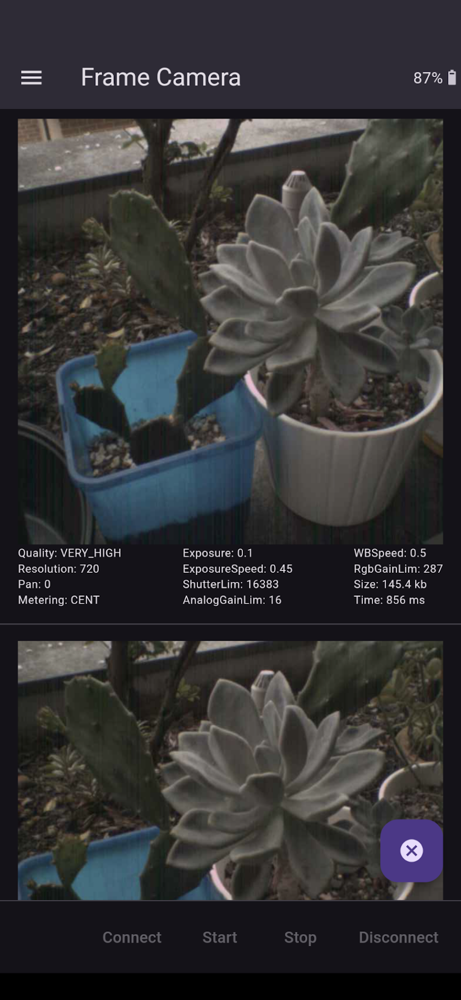

# frame_flutter_camera

Connects to Frame, initiates a photo capture and returns the image to the host app for display in a scrollable list.

### Screenshots

### Architecture

### See Also
- [Simple Frame Hello World](https://github.com/CitizenOneX/simpleframe_helloworld)
- [Frame Flutter Hello Hello](https://github.com/CitizenOneX/frame_flutter_hellohello)
