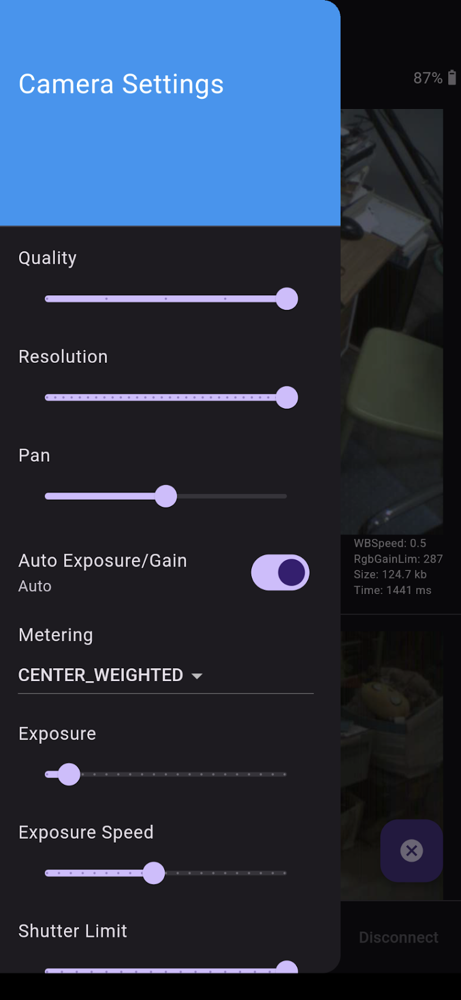

# frame_flutter_camera

Connects to Frame, initiates a photo capture and returns the image to the host app for display in a scrollable list.

Quality, Auto-Exposure/Gain Iterations, Metering Mode, Manual Exposure, Shutter KP/Shutter Limit, Gain KP/Gain Limit settings can be adjusted, and are displayed under each image.

### Screenshots

### Architecture

### See Also
- [Live Camera Feed](https://github.com/CitizenOneX/live_camera_feed)
- [Simple Frame Hello World](https://github.com/CitizenOneX/simpleframe_helloworld)
